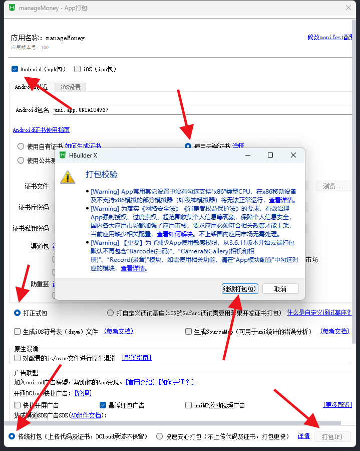
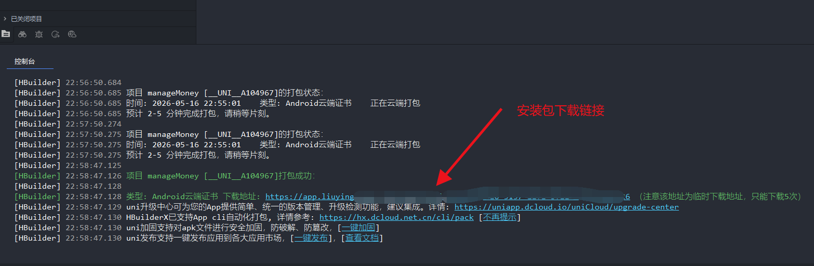

# 一起存钱之工资去哪了？

一个专为打工人设计的 **存款记账 App**。发工资那天先摸摸余额，月底再看看钱都去哪儿团建了，目标很朴素：早日存款过亿、早日退休、早日把闹钟从人生里删除。

项目基于 **uni-app（Vue 3）+ uniCloud（阿里云）** 开发，主打通过 HBuilderX 云打包成 Android/iOS App 使用；不想装 App 的朋友，也可以发布成 H5，当作一个轻量网页版账本。

项目地址：[https://github.com/yangxiaohan168/manageMoney](https://github.com/yangxiaohan168/manageMoney)

## 为什么做它

很多记账软件按自然月算账，但打工人的一个月并不是从 1 号开始的。

真正的新月份，应该从 **发工资那天** 开始。

工资 15 号发，那就按 15 号到下月 14 号算；工资 5 号发，就按 5 号到下月 4 号算。毕竟日历不会给你打钱，工资才会。

## App 图标


图标已经生成到 `static/app-icon.png`，并按 Android/iOS 云打包需要的尺寸生成到 `static/app-icons/`。`manifest.json` 里也配置好了图标路径，云打包时不用再临时翻文件夹找图标。

## 效果展示

| 月账 | 统计 |
| --- | --- |
|  |  |
| 存款 | 人情收支 |
|  |  |

## 功能介绍

### 工资周期月账

- 支持设置工资日，比如 5 号、15 号，按发薪日作为账期开始。
- 首页展示当前工资周期的收入、支出、剩余经费。
- 支持选择月份，查看任意工资周期的收支情况。
- 普通收入、普通支出、存款、人情收支会合并展示在月账明细里。

### 预支记录

- 预支不会立刻扣主结余，但会在结余旁边灰色显示扣减金额。
- 同时展示扣掉预支后的真实可活动经费，防止你以为自己还能继续潇洒。
- 预支记录可以右滑转成实际支出，确认前还能编辑名称、金额、时间和备注。

### 存款

- 支持新增、编辑、删除存款记录。
- 存款会作为当月支出扣掉，因为这笔钱虽然还在你名下，但已经被押送进小金库了。
- 单独展示累计存款，每多一笔，离“老板我先撤了”理论上近一点点。

### 人情收支

- 支持记录收礼、送礼。
- 支持朋友管理，点击朋友可查看该朋友的全部人情明细。
- 下次随礼不用再翻聊天记录考古，也不用靠玄学判断“他当年到底给了我多少”。

### 统计

- 按工资周期统计月收入、月支出、剩余经费。
- 最近 5 个月存款柱状图：看看自己是不是正在悄悄变富。
- 最近 5 天支出柱状图：专治“我也没买啥啊，钱呢？”。

## 适合谁用

- 每个月靠工资刷新人生进度条的人。
- 想知道钱到底是被房租、外卖、分期还是“我就买一点”拿走的人。
- 想存钱，但也想把支出记得像破案现场一样清楚的人。
- 想早日存款过亿、早日退休，虽然目前可能先从过万开始的人。

## 技术栈

- uni-app
- Vue 3
- uniCloud 阿里云服务空间
- uniCloud 云函数 `money-api`
- uniCloud 云数据库 Schema
- qiun-data-charts 图表组件

## 项目结构

```text
manageMoney
├─ pages/money/index.vue                         # 账本首页：月账、统计、存款、人情
├─ pages/money/friend.vue                        # 朋友人情明细页
├─ uniCloud-aliyun/cloudfunctions/money-api/     # 账本业务云函数
├─ uniCloud-aliyun/database/                     # 账本数据库 Schema
├─ uni_modules/                                  # uni-app 插件模块
├─ static/app-icon.png                           # App 主图标
├─ static/app-icons/                             # Android/iOS 云打包图标
├─ static/app-pack-1.png                         # App 云打包示例截图
├─ static/app-pack-2.png                         # App 打包成功示例截图
├─ manifest.json                                 # App/H5 配置
└─ pages.json                                    # 页面路由配置
```

## 本地运行

1. 使用 HBuilderX 打开项目根目录。
2. 登录 DCloud 账号。
3. 将 `uniCloud-aliyun` 关联到你的 uniCloud 阿里云服务空间。
4. 确认数据库 Schema 与云函数已部署，或在本地调试时选择连接云端云函数。
5. 在 HBuilderX 中运行到浏览器，访问：

```text
http://localhost:5173/h5/
```

如果浏览器访问路径不是 `/h5/`，需要确认 `manifest.json` 中 H5 路由配置：

```json
{
  "h5": {
    "router": {
      "mode": "history",
      "base": "/h5/"
    }
  }
}
```

## uniCloud 部署方法

下面以 **uniCloud 阿里云服务空间 + HBuilderX** 为例。

### 1. 准备环境

1. 安装并打开 [HBuilderX](https://www.dcloud.io/hbuilderx.html)。
2. 注册并登录 DCloud 账号。
3. 在 uniCloud 控制台创建一个阿里云服务空间，或使用已有服务空间。
4. 用 HBuilderX 打开本项目。

### 2. 关联服务空间

在 HBuilderX 项目管理器中，右键 `uniCloud-aliyun` 目录，选择关联云服务空间，并绑定到目标阿里云服务空间。

如果项目里已经关联过其他空间，可以重新关联到你自己的服务空间。

### 3. 上传数据库 Schema

右键 `uniCloud-aliyun/database` 目录，选择上传所有 DB Schema；也可以逐个右键上传以下文件：

- `uniCloud-aliyun/database/money-settings.schema.json`
- `uniCloud-aliyun/database/money-records.schema.json`
- `uniCloud-aliyun/database/money-friends.schema.json`
- `uniCloud-aliyun/database/money-human-records.schema.json`

上传后会在云数据库中创建或更新对应集合结构。首次部署不需要手动插入密码数据，第一次打开应用时会引导设置管理密码。

### 4. 部署云函数

右键以下目录，选择上传部署或上传并运行：

```text
uniCloud-aliyun/cloudfunctions/money-api
```

`money-api` 负责登录校验、日常记录、人情记录、朋友管理和统计汇总。后续只要修改了云函数代码，都需要重新上传部署。

## 打包成 Android/iOS App

项目主打 App 使用，HBuilderX 可以直接云打包，不需要你本地装 Android Studio 或 Xcode。打包前请先完成上面的 uniCloud 服务空间关联、数据库 Schema 上传和云函数部署。

### 1. 打开云打包入口

在 HBuilderX 顶部菜单点击：

```text
发行 -> App-Android/iOS-云打包
```

进入打包窗口后，根据需要勾选 Android 或 iOS，填写包名、证书、渠道包等信息。

### 2. 填写打包信息并开始打包

Android 可以先打 `apk` 测试包；iOS 如果要真机安装或上架，需要准备对应证书和描述文件。测试阶段可以先按 HBuilderX 的提示选择云端证书或测试证书。

| 云打包设置与确认 |
| --- |
|  |

打包时如果弹出权限或合规提醒，确认你不需要对应能力后可以继续。这个项目没有使用相机、录音、定位等敏感能力，主流程就是记账和云数据库读写。

### 3. 获取安装包下载链接

打包成功后，HBuilderX 控制台会输出安装包下载链接。复制链接到浏览器下载即可。

| 打包成功控制台 |
| --- |
|  |

注意：云打包生成的下载链接通常是临时链接，有下载次数或有效期限制，建议及时保存安装包。

### 4. App 图标说明

项目已经内置 App 图标：

- 主图标：`static/app-icon.png`
- Android 图标：`static/app-icons/android/`
- iOS 图标：`static/app-icons/ios/`

根据 uni-app 官方文档，Android 云打包图标配置位于 `app-plus -> distribute -> icons -> android`，iOS 云打包图标配置位于 `app-plus -> distribute -> icons -> ios`。本项目已在 `manifest.json` 中配置好这些路径。

## H5 使用方式

如果你暂时不想打包 App，也可以把它发布成 H5：

1. 确认数据库 Schema 和 `money-api` 云函数已经部署完成。
2. 在 HBuilderX 中选择 `发行 -> 网站-PC Web或手机H5`。
3. 在发布配置中选择将编译后的资源部署到 uniCloud 前端网页托管。
4. 选择目标 uniCloud 阿里云服务空间，开始构建并上传。
5. 上传完成后，在 uniCloud 控制台查看前端网页托管访问地址。
6. 如果绑定了自定义域名，按控制台提示完成域名解析、HTTPS 和安全域名配置。

发布后，打开云托管地址访问应用。第一次进入时设置管理密码，即可开始使用。

## H5 云托管发布示意

| 选择云托管并点击发行 | 发布完成后查看网站链接 |
| --- | --- |
|  |  |

## 参考文档

- [uni-app App 图标配置](https://en.uniapp.dcloud.io/tutorial/app-icons.html)
- [uniCloud 发行](https://doc.dcloud.net.cn/uniCloud/publish.html)
- [云函数/云对象运行方式介绍](https://doc.dcloud.net.cn/uniCloud/rundebug.html)
- [DB Schema 概述](https://doc.dcloud.net.cn/uniCloud/schema.html)
