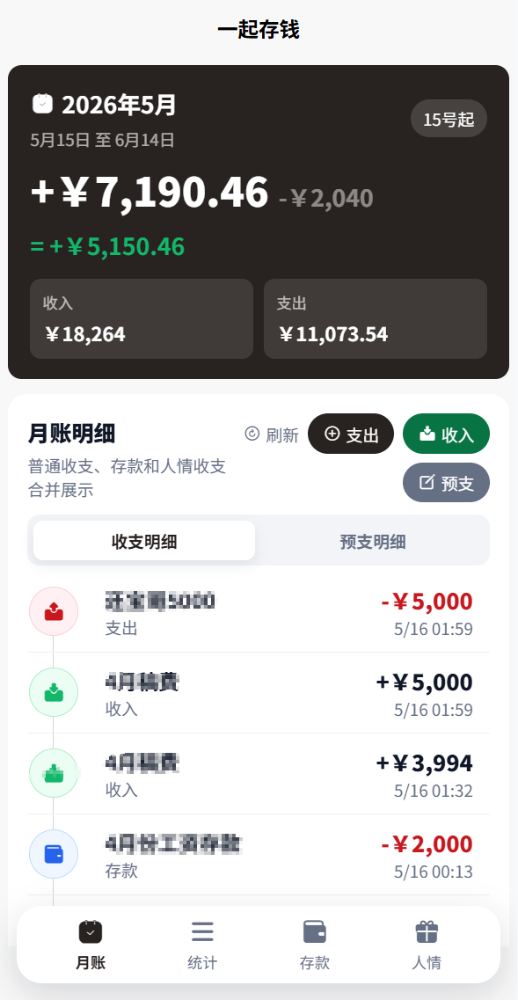
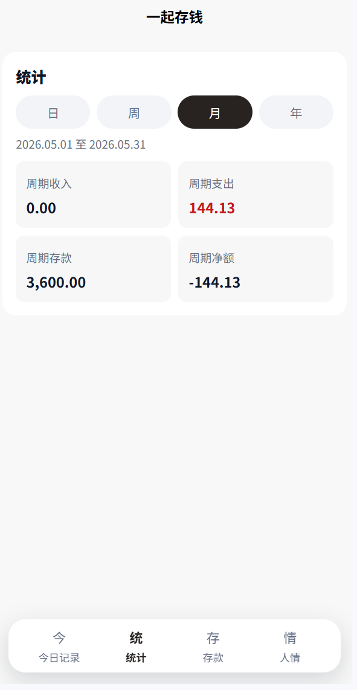
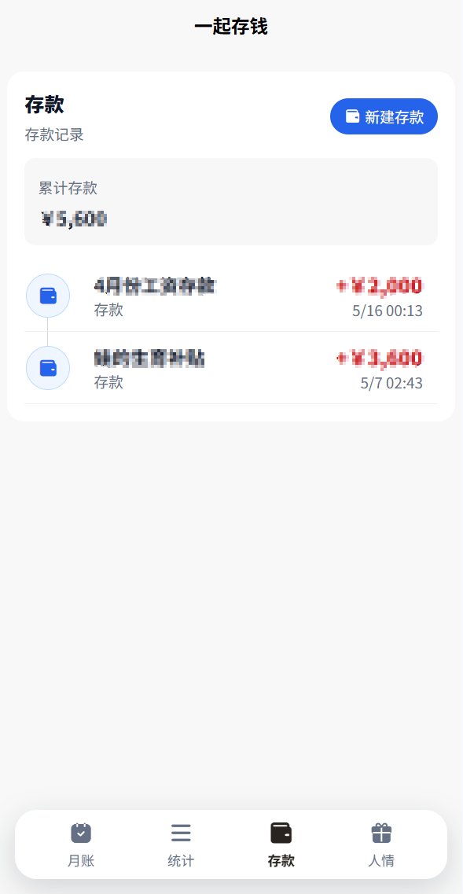
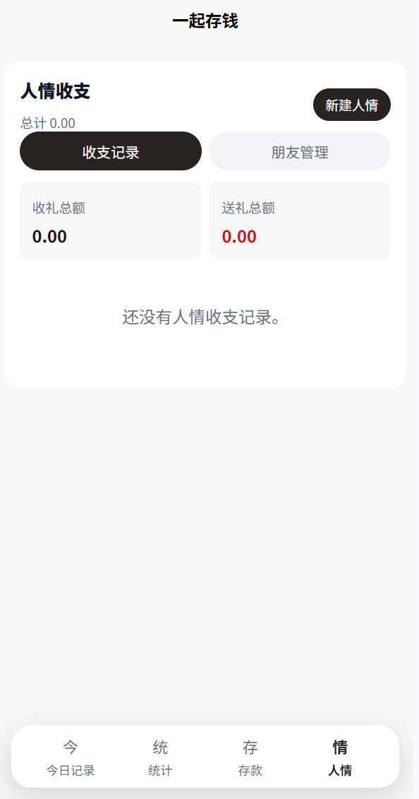
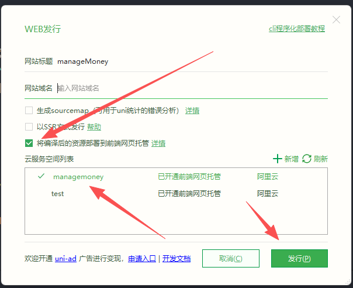
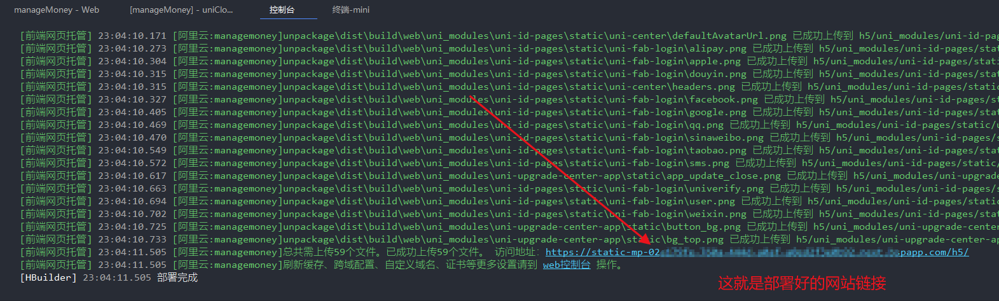

# 一起存钱之工资哪去了？

一个专为牛马打工人设计的 **存款记账 H5**。发工资那天先摸摸余额，月底再看看钱都去哪儿团建了，目标是：早日存款过亿、早日退休、早日把闹钟从人生里删除。

项目基于 **uni-app（Vue 3）+ uniCloud（阿里云）**，前端主要发布为 H5，后端通过 uniCloud 云函数读写云数据库。无需自建服务器。

## 一个月5块钱。不需要域名，可以用官方域名，够用了

## 效果展示

| 月账 | 统计 |
| --- | --- |
|  |  |
| 存款 | 人情收支 |
|  |  |

本地预览地址示例：

```text
http://localhost:5173/h5/
```

## 功能介绍

### 账本登录

- 首次访问时设置管理密码。
- 密码使用盐值哈希后保存到 `money-settings` 集合。
- 登录后会在本机缓存访问 token，token 过期或校验失败时需要重新输入密码。

### 月账首页

- 按工资周期记账，不再跟自然月死磕。工资 15 号发，就按 15 号到下月 15 号算，主打一个“发薪日才是朕的初一”。
- 首页展示本周期收入、支出和剩余经费，让你一眼看清本月还能不能继续点奶茶。
- 工资发放日可直接在顶部卡片选择，适配 5 号党、15 号党等等各种发薪日，以及每月等工资等到心态平和党。
- 支持收入、支出、存款、预支、人情收支合并查看，钱从哪里来、又从哪里溜走，都安排得明明白白。
- 收支明细和预支明细分 tab 展示，左滑可编辑、删除；预支还能一键转为实际支出，适合“先记一笔，等真花了再算账”的人间真实。

### 预支记录

- 预支不直接扣主结余，但会在结余旁边灰色显示扣减金额，并显示扣掉预支后的真实可活动经费。
- 预支记录可以右滑转为支出，确认前还能改名称、金额、时间和备注，给冲动消费留最后一次反悔机会。
- 适合记录即将扣款、先占预算、还没真正花出去的钱，比如“这顿饭我先预判它会背刺我”。

### 统计

- 统计只按工资周期走，不再日周月年反复横跳，减少选择困难，保护打工人脑容量。
- 展示本周期月收入、月支出、剩余经费。
- 最近 5 个月存款柱状图：看看自己是不是正在悄悄变富，哪怕只是余额多活了两天。
- 最近 5 天支出柱状图：专治“我也没买啥啊，钱呢？”。
- 人情送礼、存款都会进入支出口径，毕竟钱出去了就是出去了，钱包不会因为它叫“存款”就不疼。

### 存款

- 存款记录独立成页，专门给未来退休基金一个体面的座位。
- 支持新增存款、分页加载、编辑和删除。
- 展示累计总存款。每多一笔，离“老板我先撤了”理论上就近一点点。
- 存款在月账里会作为当月支出扣掉，因为这笔钱已经被你从活动经费里押送进小金库了。

### 人情收支

- 支持记录收礼、送礼两类人情往来，避免下次随礼时全靠玄学和聊天记录考古。
- 支持朋友管理，朋友可新增、编辑、删除。
- 人情首页展示收礼总额、送礼总额和净额，礼尚往来，账也要往来。
- 点击朋友可进入朋友详情页，查看该朋友的全部人情明细。

### 数据与权限

- 主要数据集合：
  - `money-settings`：管理密码与 token 版本配置。
  - `money-records`：收入、支出、存款、预支记录。
  - `money-friends`：朋友信息。
  - `money-human-records`：人情收支记录。
- 数据库 Schema 中默认关闭客户端直连增删改查，业务数据统一通过 `money-api` 云函数处理。
- 金额在数据库中以“分”为单位保存，展示时转换为元。


## 适合谁用

- 每个月靠工资刷新人生进度条的人。
- 想知道钱到底是被房租、外卖、白条、分付，还是被“我就买一点”拿走的人。
- 想存钱，但也想把支出记得像破案现场一样清楚的人。
- 想早日存款过亿、早日退休，虽然目前可能先从过万开始的人。

## 技术栈

- uni-app
- Vue 3
- uniCloud 阿里云服务空间
- uniCloud 云函数 `money-api`
- uniCloud 云数据库 Schema
- qiun-data-charts 图表组件

## 项目结构

```text
manageMoney
├─ pages/money/index.vue                         # 账本首页：月账、统计、存款、人情
├─ pages/money/friend.vue                        # 朋友人情明细页
├─ uniCloud-aliyun/cloudfunctions/money-api/     # 账本业务云函数
├─ uniCloud-aliyun/database/                     # 账本数据库 Schema
├─ uni_modules/                                  # uni-app 插件模块
├─ static/                                       # README 截图和静态资源
├─ manifest.json                                 # H5 路由 base 为 /h5/
└─ pages.json                                    # 页面路由配置
```

## 本地运行

1. 使用 HBuilderX 打开项目根目录。
2. 登录 DCloud 账号。
3. 将 `uniCloud-aliyun` 关联到你的 uniCloud 阿里云服务空间。
4. 确认数据库 Schema 与云函数已部署，或在本地调试时选择连接云端云函数。
5. 在 HBuilderX 中运行到浏览器，访问：

```text
http://localhost:5173/h5/
```

如果浏览器访问路径不是 `/h5/`，需要确认 `manifest.json` 中 H5 路由配置：

```json
{
  "h5": {
    "router": {
      "mode": "history",
      "base": "/h5/"
    }
  }
}
```

## uniCloud 部署方法

下面以 **uniCloud 阿里云服务空间 + HBuilderX + H5 前端网页托管** 为例。

### 1. 准备环境

1. 安装并打开 [HBuilderX](https://www.dcloud.io/hbuilderx.html)。
2. 注册并登录 DCloud 账号。
3. 在 uniCloud 控制台创建一个阿里云服务空间，或使用已有服务空间。
4. 用 HBuilderX 打开本项目。

### 2. 关联服务空间

在 HBuilderX 项目管理器中，右键 `uniCloud-aliyun` 目录，选择关联云服务空间，并绑定到目标阿里云服务空间。

如果项目里已经关联过其他空间，可以重新关联到你自己的服务空间。

### 3. 上传数据库 Schema

右键 `uniCloud-aliyun/database` 目录，选择上传所有 DB Schema；也可以逐个右键上传以下文件：

- `uniCloud-aliyun/database/money-settings.schema.json`
- `uniCloud-aliyun/database/money-records.schema.json`
- `uniCloud-aliyun/database/money-friends.schema.json`
- `uniCloud-aliyun/database/money-human-records.schema.json`

上传后会在云数据库中创建或更新对应集合结构。首次部署不需要手动插入密码数据，第一次打开应用时会引导设置管理密码。

### 4. 部署云函数

右键以下目录，选择上传部署或上传并运行：

```text
uniCloud-aliyun/cloudfunctions/money-api
```

`money-api` 负责登录校验、日常记录、人情记录、朋友管理和统计汇总。后续只要修改了云函数代码，都需要重新上传部署。

### 5. 本地联调

在 HBuilderX 中运行到浏览器后，确认客户端连接的是目标 uniCloud 空间。

若 H5 页面能打开但调用云函数失败，优先检查：

- `uniCloud-aliyun` 是否已关联正确服务空间。
- `money-api` 是否已上传部署成功。
- 数据库 Schema 是否已上传。
- uniCloud 控制台的跨域配置/安全域名是否包含当前访问域名，例如本地调试域名或正式站点域名。

### 6. 发布 H5 到前端网页托管

1. 确认数据库 Schema 和 `money-api` 云函数已经部署完成。
2. 在 HBuilderX 中选择 `发行 -> 网站-PC Web或手机H5`。
3. 在发行配置中选择将编译后的资源部署到 uniCloud 前端网页托管。
4. 选择目标 uniCloud 阿里云服务空间，开始构建并上传。
5. 上传完成后，在 uniCloud 控制台查看前端网页托管访问地址。
6. 如果绑定了自定义域名，按控制台提示完成域名解析、HTTPS 和安全域名配置。

发布后，打开云托管地址访问应用。第一次进入时设置管理密码，即可开始使用。

## 云托管发布示意

| 选择云托管并点击发行 | 发布完成后查看网站链接 |
| --- | --- |
|  |  |


## 参考文档

- [uniCloud 发行](https://doc.dcloud.net.cn/uniCloud/publish.html)
- [云函数/云对象运行方式介绍](https://doc.dcloud.net.cn/uniCloud/rundebug.html)
- [DB Schema 概述](https://doc.dcloud.net.cn/uniCloud/schema.html)
